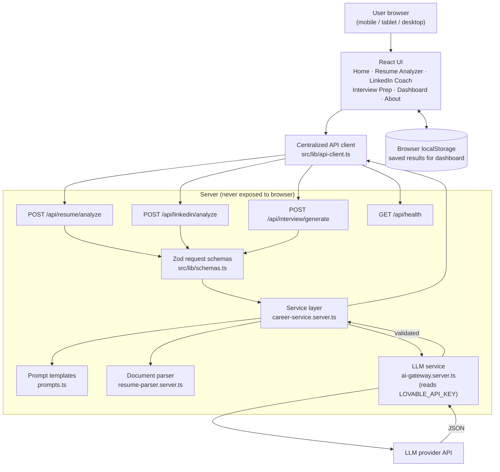
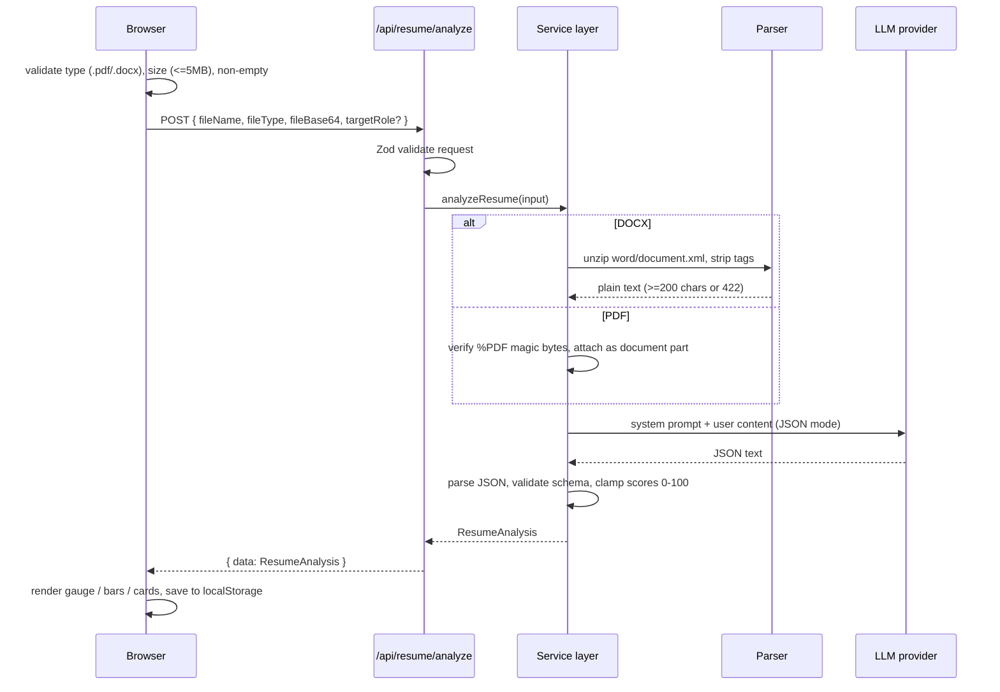
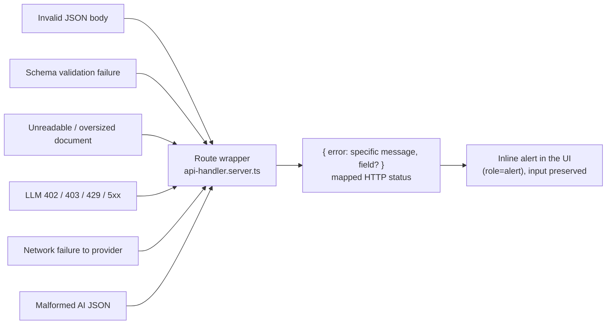
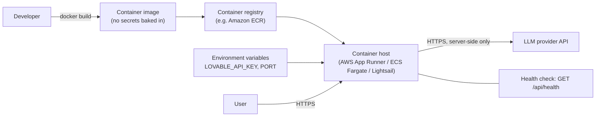

# CareerCraft AI — Architecture

## System overview

## Resume analysis sequence

## Error-handling model

No failure path substitutes fabricated or partial AI data.

## Deployment shape (target)

